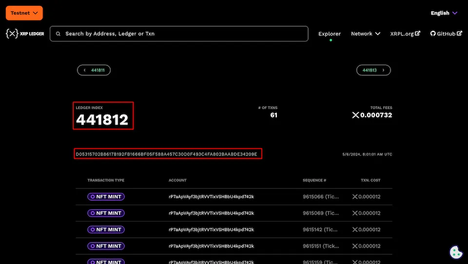

import { Aside, Steps } from '@astrojs/starlight/components';

先ほどの章で、アリスはチャーリーが発行体のトークンに対し、トラストラインをセットしました。

この章で、トラストラインがセットできているか確認することを目的に、`rippled`の`パブリックメソッド`を合わせて覚えてみましょう！

アカウント情報を取得するには、`rippled`の`パブリックメソッド`である`アカウントメソッド`を使用します。

## 前提

このガイドは、以下の登場人物が登場する設定で進行しています。

- チャーリー（トークン発行者）
- アリス（トークン受領者）

## スクリプトを作成

アカウントが送金または受領できる通貨のリストを確認するため、[account_currencies](https://xrpl.org/ja/docs/references/http-websocket-apis/public-api-methods/account-methods/account_currencies/#account_currencies)コマンドを使用します。

<Steps>

1. プロジェクトディレクトリに`check_account_currencies.js`という新しいファイルを作成します。
2. 以下のコードを`check_account_currencies.js`に貼り付けます。

    今回は再利用できるメソッドとして作成しています。`checkAccountCurrencies()`は引数の`accountAddress`に渡されたアドレスを元に情報を取得するメソッドです。

    <Aside>※`try catch`という例外処理手法をメソッド内に組み込んでいます。これまでの章でも使用していましたが、開発初心者の方は合わせて覚えてみましょう。</Aside>

    ```javascript
    const xrpl = require('xrpl');

    async function checkAccountCurrencies(accountAddress) {
        // Testnetサーバーに接続します
        const client = new xrpl.Client('wss://s.altnet.rippletest.net:51233');

        // client.connect()メソッドを呼び出して、サーバーに接続します
        // awaitを使って、接続が完了するまで待機します
        await client.connect();

        try {
            // account_currencies コマンドでトークンリストを取得します
            const response = await client.request({
                command: 'account_currencies',
                account: accountAddress,
                ledger_index: 'validated' // 確実に検証済みのレジャーから取得するには'validated'指定する必要があります
            });

            // コンソールに結果を出力します
            console.log('Account Lines:', response);
        } catch (error) {
            console.error('Error retrieving account lines:', error);
        }

        // client.disconnect()メソッドを呼び出して、サーバーとの接続を切断します
        await client.disconnect();
    }

    const charlieAddress = 'charlie_wallet_address_here'; // チャーリーのアドレス
    checkAccountCurrencies(charlieAddress); // 関数に引数としてアカウントアドレスを渡します

    const aliceAddress = 'alice_wallet_address_here'; // アリスのアドレス
    checkAccountCurrencies(aliceAddress);
    ```

    1. `charlie_wallet_address_here`には、テストネットのチャーリーのアドレスを入力してください。
    2. `alice_wallet_address_here`には、テストネットのアリスのアドレスを入力してください。
</Steps>

## スクリプトの実行

<Steps>

1. コマンドラインで以下のコマンドを実行して、スクリプトを実行します。

    ```bash
    node check_account_currencies.js
    ```

2. 成功すれば、コンソールに以下が表示されます。

    ```bash
    Account Lines: { // チャーリーの情報
        id: 1,
        result: {
            ledger_hash: 'D05315702B8617B192FB1666BF05F588A457C30D0F493C4FA802BAABDE34209E',
            ledger_index: 441812, // レジャーインデックス番号（このデータの参照元）
            receive_currencies: [], // 受領可能なトークンの配列
            send_currencies: [ 'DOJ' ], // 送信可能なトークンの配列
            validated: true // 検証済みの最新のレジャーから取得しているか？
        },
        type: 'response'
    }
    Account Lines: { // アリスの情報
        id: 1,
        result: {
            ledger_hash: 'D05315702B8617B192FB1666BF05F588A457C30D0F493C4FA802BAABDE34209E',
            ledger_index: 441812,
            receive_currencies: [ 'DOJ' ], // アリスが受領可能なトークンの配列
            send_currencies: [],
            validated: true
        },
        type: 'response'
    }
    ```

    `DOJ`トークンの発行者であるチャーリーのアカウント情報の、`send_currencies`に`DOJ`トークンが含まれており、アリスのアカウント情報でも、`receive_currencies`の配列に`DOJ`トークンが受領できる状態であることも確認できました。

    このように、XRPLではウォレットごとのアカウント情報（状態）を保持しており、それらを元に厳密に検証・取引が行われています。
</Steps>

## ledger_index、ledger_hashとは？

上記のコンソール・ログに`ledger_hash`が表示されたと思いますが、これはユニークなレジャー（台帳）のハッシュ値です。
このサンプルでは`441812`番目に検証されたレジャーからデータを取得したということになります。

実際に、テストネットで`441812`番目に検証された[レジャー](https://testnet.xrpl.org/ledgers/441812)を確認してみましょう。



このレジャー（`441812`）のレジャーハッシュ値は`D05315702B8617B192FB1666BF05F588A457C30D0F493C4FA802BAABDE34209E`となっており、上記のコンソール・ログと一致していることを確認できます。
コードなどの技術的な部分だけでなく、XRPLの全体像を理解していくにはこのように、目視で一つ一つ意味を確認・理解していくことが重要となります。

また、[XRPL Explorer](https://livenet.xrpl.org/)は[テストネット版](https://testnet.xrpl.org/)も提供しており、開発に必要なツールの一つなのでブックマークしておきましょう。
