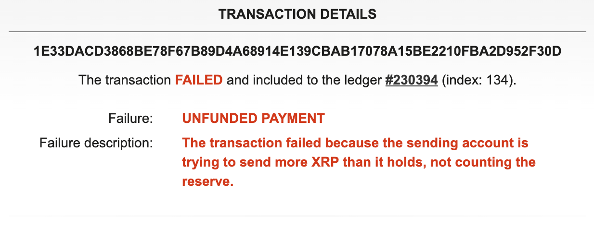

import { Steps } from '@astrojs/starlight/components';

## スクリプトを作成

<Steps>

1. プロジェクトディレクトリに`send_xrp.js`という新しいファイルを作成します。
2. 以下のコードを`send_xrp.js`に貼り付けます。

   ```javascript
   const xrpl = require('xrpl');

   async function main() {
     // Testnetサーバーに接続
     const client = new xrpl.Client('wss://s.altnet.rippletest.net:51233');
     await client.connect();

     // 送信用のウォレット情報を設定
     // これはサンプルであり、実際の秘密鍵を使用する場合は注意が必要です
     const sender = xrpl.Wallet.fromSeed('your_wallet_seed_here');

     // 送信先アドレスと送金額を設定
     const recipient = 'recipient_address_here';
     const amount = '100'; // 100XRP : 送信するXRPの量

     // トランザクションの準備
     const prepared = await client.autofill({
       TransactionType: 'Payment',
       Account: sender.address,
       Amount: xrpl.xrpToDrops(amount), // XRPをDropsに変換
       Destination: recipient,
     });
     console.log('Prepared transaction:', prepared);

     // トランザクションの署名
     const signed = sender.sign(prepared);
     console.log('Signed transaction:', signed);

     // トランザクションの送信
     const result = await client.submitAndWait(signed.tx_blob);
     console.log('Transaction result:', result);

     // 接続を閉じる
     client.disconnect();
   }

   main().catch(console.error);
   ```

   1. `your_wallet_seed_here`には、テストネットの送信元アドレスのシークレットキーを入力してください。
   2. `recipient_address_here`には、テストネットの送信先アドレスを入力してください。
</Steps>

## スクリプトの実行

<Steps>

1. コマンドラインで以下のコマンドを実行して、スクリプトを実行します。

    ```bash
    node send_xrp.js
    ```

    成功すれば、コンソールに以下が表示されます。

    ```bash
    Prepared transaction: {
        TransactionType: 'Payment',
        Account: 'r2UUsk6CLuLSDLYi5yhswa378tQ9cGLQW',
        Amount: '100000000',
        Destination: 'rHjHkeRJ7PMQXbghGKYL9NkTvksoixkojV',
        Flags: 0,
        NetworkID: undefined,
        Sequence: 230386,
        Fee: '12',
        LastLedgerSequence: 230412
    }
    Signed transaction: {
        tx_blob: '120000220000000024000383F2201B0003840C614000000005F5E10068400000000000000C7321ED4CA842EEAEF0676AE4DEA3E1ACFDB4C5EFBDC2034091627BF4BE1EE3683C948374408E6DEA70D583884639692A69CF0D76CC30FE368C41967B87FA5E717462F1F768DFE6205A285747963F52D7A61AAB77F09A967E9459C6770543ED1CF233EF8D0481140647116D6E951B75A250510595C2E2772F56584A8314B781779BC48D6A07B5685B1D2EBE7AE0F0B7B2EF',
        hash: '1E33DACD3868BE78F67B89D4A68914E139CBAB17078A15BE2210FBA2D952F30D'
    }
    Transaction result: {
        id: 12,
        result: {
            Account: 'r2UUsk6CLuLSDLYi5yhswa378tQ9cGLQW',
            Amount: '100000000',
            DeliverMax: '100000000',
            Destination: 'rHjHkeRJ7PMQXbghGKYL9NkTvksoixkojV',
            Fee: '12',
            Flags: 0,
            LastLedgerSequence: 230412,
            Sequence: 230386,
            SigningPubKey: 'ED4CA842EEAEF0676AE4DEA3E1ACFDB4C5EFBDC2034091627BF4BE1EE3683C9483',
            TransactionType: 'Payment',
            TxnSignature: '8E6DEA70D583884639692A69CF0D76CC30FE368C41967B87FA5E717462F1F768DFE6205A285747963F52D7A61AAB77F09A967E9459C6770543ED1CF233EF8D04',
            ctid: 'C00383FA00860001',
            date: 767641940,
            hash: '1E33DACD3868BE78F67B89D4A68914E139CBAB17078A15BE2210FBA2D952F30D',
            inLedger: 230394,
            ledger_index: 230394,
            meta: {
            AffectedNodes: [Array],
            TransactionIndex: 134,
            TransactionResult: 'tecUNFUNDED_PAYMENT'
            },
            validated: true
        },
        type: 'response'
    }
    ```

2. 表示されたhash値`1E33DACD3868BE78F67B89D4A68914E139CBAB17078A15BE2210FBA2D952F30D`をテストネットのエクスプローラにて[検索](https://test.bithomp.com/explorer/1E33DACD3868BE78F67B89D4A68914E139CBAB17078A15BE2210FBA2D952F30D)してみます。
    
    すると…`UNFUNDED PAYMENT`という表示がされていますが、これは送信に失敗している状態となります。

    

    実は、コンソールに表示された`TransactionResult`フィールドの値を元に、結果を確認することができます！上記で`TransactionResult: 'tecUNFUNDED_PAYMENT'`と表示されていることを確認してください。

    このトランザクションを送信したアドレスはFaucetツールで100XRP発行されていますが、実際に使用できる残高は準備金として10XRPを除いた金額（約90XRP）となります。また送信時に手数料を支払う必要があるため、90XRPの送金でも失敗する可能性があるということを覚えておいてください。このようにトランザクションは厳密に検証されています。

3. 次に`send_xrp.js`のソースを`const amount = '50';`と変更してから、`node send_xrp.js`コマンドを実行してみてください。

    ```bash
    Transaction result: {
        id: 12,
        result: {
            Account: 'r2UUsk6CLuLSDLYi5yhswa378tQ9cGLQW',
            Amount: '50000000',
            DeliverMax: '50000000',
            Destination: 'rHjHkeRJ7PMQXbghGKYL9NkTvksoixkojV',
            Fee: '12',
            Flags: 0,
            LastLedgerSequence: 230757,
            Sequence: 230387,
            SigningPubKey: 'ED4CA842EEAEF0676AE4DEA3E1ACFDB4C5EFBDC2034091627BF4BE1EE3683C9483',
            TransactionType: 'Payment',
            TxnSignature: '7998B34A2A0B574A878D7E3F2B852C2ACD0D752544AD77670242F9B27524949F45AF64BEFAA0296566CEAFCD6404E65347C2E8CAFA010A691B38F2736769A90A',
            ctid: 'C003855300000001',
            date: 767643022,
            hash: '8E6F6D695BA8EE2BCB2DE00336E51E6277F5F80DB12A553C099DCBB5ECB5E9C4',
            inLedger: 230739,
            ledger_index: 230739,
            meta: {
            AffectedNodes: [Array],
            TransactionIndex: 0,
            TransactionResult: 'tesSUCCESS',
            delivered_amount: '50000000'
        },
        validated: true
    },
    ```

    今度は、`TransactionResult: 'tesSUCCESS'`とレスポンスが返ってきており、送金が成功していることを確認できました。
</Steps>

## さいごに

クライアントライブラリである`xrpl.js`を利用することで、XRPの送金を簡単に行えることがわかっていただいたかと思います。
基本的にはトランザクションを送る方法はその他も同様で、`TransactionType: 'Payment'`と指定している箇所を別の`TransactionType`である`TrustSet`に変更することで、トラストラインの実装が可能です。

このように一般的なWeb開発者や初心者でも簡単にパブリック・ブロックチェーンを利用できることが、XRPLのエコシステムの強みであると思います。