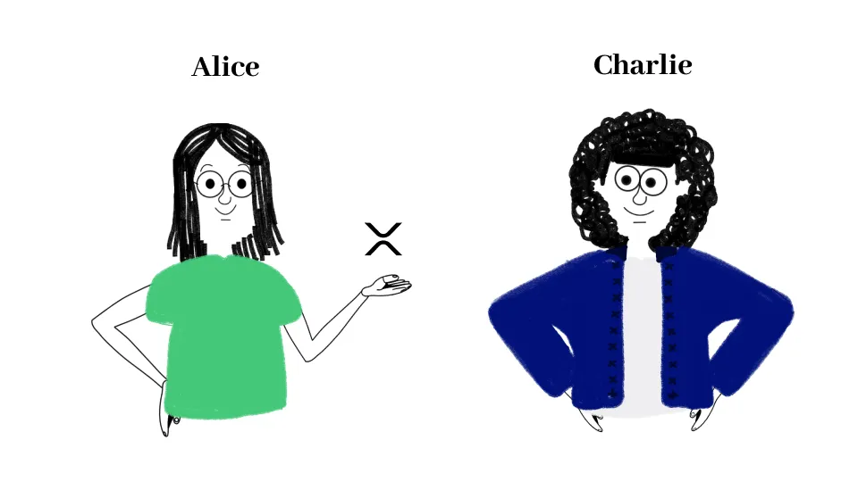

import { Steps } from '@astrojs/starlight/components';

## トラストラインとは？

XRPL（XRP Ledger）のトラストライン機能は、ユーザーが特定の通貨を受け入れる意向を示すためのものです。これは、XRP以外の資産をXRPL上で取り扱うために使用されます。例えば、あるユーザーが別の通貨や発行体のトークンを受け入れる場合、そのユーザーはその通貨に対してトラストラインを設定する必要があります。

トラストライン機能によってユーザーは他のユーザーや発行体が発行した資産を自分のアカウントで保持し、取引することを許可しています。例えば、アリスがチャーリーが発行体のトークンに対してトラストラインを設定することで、トークンをアリスは受け取ることが可能となります。

メリットとしては、受領を許可していないトークンを自身のアドレスに勝手に送金されることを防ぐことでき、ユーザー間の秩序を守ることができます。



## 前提

このガイドでは、以下の登場人物が登場する設定で進行します。

- チャーリー（トークン発行者）
- アリス（トークン受領者）

## スクリプトを作成

以下は、アリスからチャーリーが発行体のトークンにトラストラインをセットするスクリプトです。

<Steps>

1. プロジェクトディレクトリに`trust_set.js`という新しいファイルを作成します。
2. 以下のコードを`trust_set.js`に貼り付けます。

    ```javascript
    const xrpl = require('xrpl');

    // TrustSetトランザクションを送信する関数
    async function trustSet(recipientSecret) {
        // Testnetサーバーに接続します
        const client = new xrpl.Client('wss://s.altnet.rippletest.net:51233');
        await client.connect();

        try {
            // トークン発行者のウォレットアドレス（チャーリー）
            const issuerWalletAddress = 'charlie_wallet_address_here';

            // トークン受領者のウォレットを設定
            const recipientWallet = xrpl.Wallet.fromSecret(recipientSecret);

            // トークンに関する固定の情報
            const currencyCode = 'DOJ'; // 通貨コード
            const amount = '10000'; // 最大受領可能なトークンの量

            // TrustSetトランザクションを送信する
            const response = await client.submitAndWait(
                {
                    TransactionType: 'TrustSet', // トラストラインを設定
                    Account: recipientWallet.address, // アリスのアドレス
                    LimitAmount: {
                        issuer: issuerWalletAddress, // 発行体のアドレス（チャーリー）
                        currency: currencyCode, // DOJ
                        value: amount, // 10000
                    },
                },
                { wallet: recipientWallet } // アリスのウォレットで署名
            );

            // コンソールに結果を出力する
            console.log('Transaction result:', response);
        } catch (error) {
            // エラーハンドリング
            console.error('An error occurred:', error);
        }

        // サーバーとの接続を切断する
        client.disconnect();
    }

    // 関数を実行する
    const recipientSecret = 'alice_wallet_secret_here'; // アリスのシークレットキーを設定
    trustSet(recipientSecret);
    ```

   1. `charlie_wallet_address_here`には、テストネットのチャーリーのアドレスを入力してください。
   2. `alice_wallet_secret_here`には、テストネットのアリスのシークレットキーを入力してください。
</Steps>

## スクリプトの実行

1. コマンドラインで以下のコマンドを実行して、スクリプトを実行します。

    ```bash
    node trust_set.js
    ```

    成功すれば、コンソールに以下が表示されます。

    ```bash
    Transaction result: {
        id: 14,
        result: {
            Account: 'rQr8KfkCQcpqvFwmRspDoaL36reZhcdaeA', // アリスのアドレス
            Fee: '12',
            Flags: 0,
            LastLedgerSequence: 474997,
            LimitAmount: {
                currency: 'DOJ', // 通貨コード
                issuer: 'rh8xETfGs1Ktizj9EXZb5QpW4aqk8bWUSU', // トークン発行者のアドレス（チャーリー）
                value: '10000' // アリスがDOJトークンを受け取れる最大値
            },
            Sequence: 474064,
            SigningPubKey: 'ED2924DBD08E093DD7FC9C35B8DCEBD74CA4C8349D68D7BF566AD6C2533B8BB865',
            TransactionType: 'TrustSet',
            TxnSignature: '8245C9412BA9E247D962B2D9B9B6B74A90D3757FDA66422527611971004F94D803607A3CC5357BA83B0FA0B7D010B10F3D0F5188EE8D4F1D72181BFA4D052B0B',
            ctid: 'C0073F6300000001',
            date: 768402681,
            hash: 'A20A377A4E9D8CAAA62E5AEE7CDFB9FBC690171B1D13485AC40A6313996A98C8', // ハッシュ値
            inLedger: 474979,
            ledger_index: 474979, // レジャーインデックス番号
            meta: {
                AffectedNodes: [Array],
                TransactionIndex: 0,
                TransactionResult: 'tesSUCCESS' // 成功
            },
            validated: true // 検証済みのトランザクション
        },
        type: 'response'
    }
    ```

    これでチャーリーが発行体のトークン、`DOJ`をアリスが受け取ることが可能になりました。