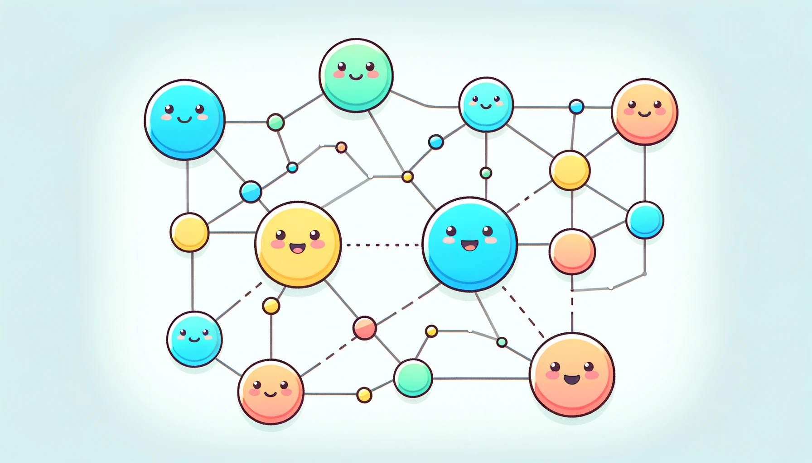

XRP Ledger（XRPL）は、ビットコインに代表されるブロックチェーン・ネットワークのひとつだよ！

ブロックチェーン・ネットワークはインターネット上でも、人々が直接お金のやりとりができることが特徴なんだ。

この章では、なるべくわかりやすく説明していくよ！

## XRPL の基本（きほん）

- XRPL は、お金の取引を記録するシステムのことだよ。
- XRP っていうデジタルのお金が使われていて、すごく速くて安く送金ができるのが特徴なんだ。
- XRPL には管理している人や組織はいないよ。みんなで支え合って動いているんだ！
- 世界中の誰もが自由に使えるものだよ。
- XRP というお金の価値はドルや円などと同じように、毎日変動（へんどう）するよ！

## XRPL のいいところ

1. 送金がめちゃくちゃ速い！ほんの数秒で終わっちゃうんだ。
2. 手数料がとっても安い！1 回の送金で、ほんのわずかなお金しかかからないんだよ。
3. 世界中のお金を、簡単に交換できるんだ。

{/*  */}

## XRPL の仕組み（しくみ）

- XRPL は、バリデーターっていう、たくさんのコンピューターによって動いているんだ。
- バリデーターは、取引が正しいかどうかを確認して、記録する大切な役割を持っているんだよ。
- みんなで話し合って、バリデーター同士が合意形成（ごういけいせい）を行っているんだ。

## XRPL の将来（しょうらい）

- 銀行が XRPL に興味を持っていて、国境をこえた取引などに使い始めているんだ。
- XRPL はだれでも使えるよ！世界中の人々がアイデアを出し合うことで、世界中のお金のやり取りで、XRPL の利用がどんどん広がっていきそうだよ。
- 将来的には、XRPL が、世界中のお金のやり取りで、とっても重要な方法になるかもしれないね。

以上が、XRPL についての基本的な解説だよ！

XRPL は、世界中のお金（価値）のやり取りを、もっと便利にする技術として期待されているんだ。  
みんなも、XRPL に注目してみてね！
